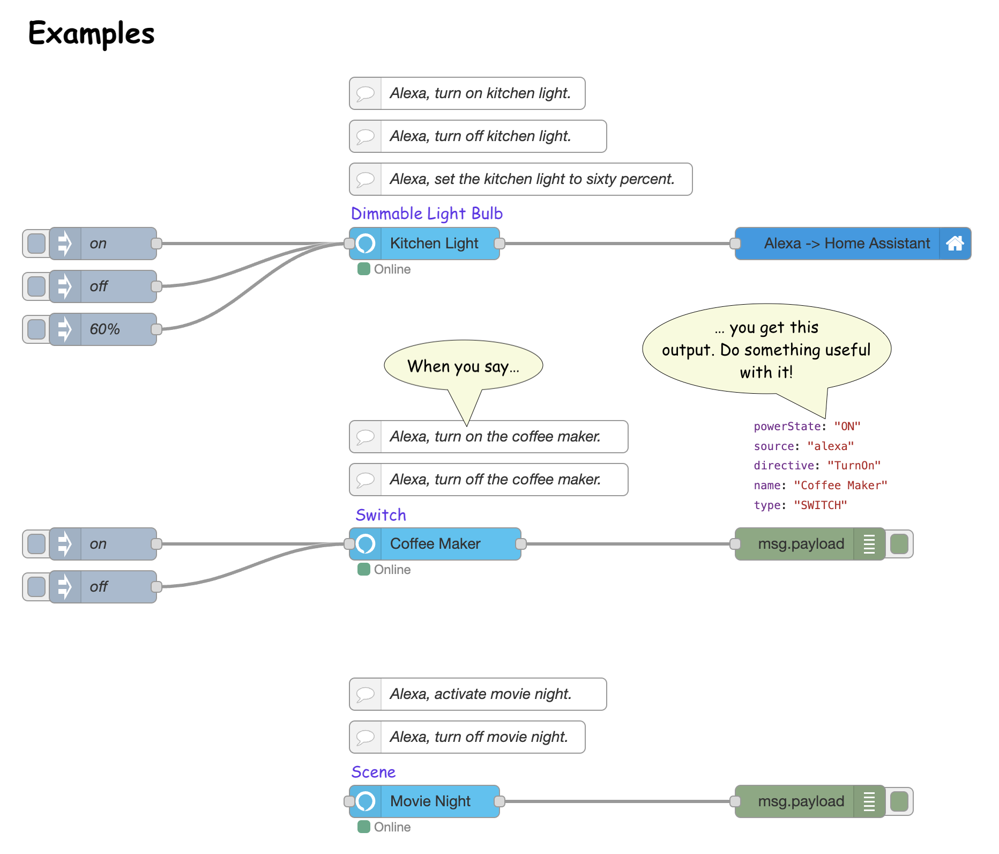

# Virtual Smart Home (VSH)

**Do stuff in Node-RED with Amazon Alexa – no custom hardware, no separate accounts, no hassle.**

**Virtual Smart Home (VSH)** is a powerful Node-RED node that lets you create virtual smart home devices directly on your flow canvas. These devices integrate natively with Amazon Alexa using the [_Virtual Smart Home_ skill](https://www.amazon.com/dp/B08Q7BNKWG), allowing you to control and automate your home like never before.



---

## ✨ Why Choose VSH?

- 🧱 **Drag & Drop Simplicity**  
  Add new virtual devices in Node-RED and they instantly appear in Alexa — no discovery phrase needed.

- ❌ **No Extra Accounts**  
  Just link your Amazon account. No extra sign-ups, no cloud dashboards to manage.

- 🔄 **Live Sync with Alexa**  
  Rename or change device types, and Alexa reflects the changes in real time.

- 🔐 **Secure by Design**  
  Communicates via individually provisioned certificates using a secure cloud connection.

- 🔁 **Two-Way Sync**  
  Push updates from Node-RED to Alexa — perfect for keeping things in sync when local changes happen.

- 🧹 **Automatic Cleanup**  
  Remove devices from Node-RED and they're automatically removed from Alexa, too. Orphaned devices? Clean them up easily in the editor.

---

## 🚀 Supported Device Types

VSH supports a growing range of Alexa-compatible devices:

- Blinds  
- Color Changing Light Bulb  
- Contact Sensor  
- Dimmable Light Bulb  
- Dimmer Switch  
- Doorbell Event Source  
- Entertainment Device  
- Fan  
- Garage Door Opener _(en-US only)_  
- Lock  
- Motion Sensor  
- Plug  
- Scene  
- Switch  
- Temperature Sensor  
- Thermostat (Single- and Dual-Setpoint)

---

## ⚙️ How It Works

VSH connects Alexa voice commands to your smart home flows in Node-RED.

For example, when you say:

> _"Alexa, dim the kitchen light to 50 percent"_

The node emits a `msg` object like this:

```json
{
  "topic": "home/kitchen/lights",
  "metadata": { "foo": "bar" },
  "payload": {
    "brightness": 50,
    "powerState": "ON",
    "source": "alexa",
    "directive": "SetBrightness",
    "name": "kitchen light",
    "type": "DIMMABLE_LIGHT_BULB"
  }
}
```

You can use this `msg` to control physical devices — for example, via MQTT or Home Assistant.

And it works both ways: Send a `msg` into the node to update Alexa with local state changes. If passthrough is enabled, Alexa gets updated and an outbound message is sent too (`payload.source = "device"`).

---

## 🧠 Ideal For

- Home automation enthusiasts who want voice control without cloud lock-in  
- Developers building custom smart home flows  
- Anyone who uses Node-RED and Alexa together

---

## 📦 Get Started

Install from the Node-RED palette or via npm:

```bash
npm install node-red-contrib-virtual-smart-home
```

Then enable the [_Virtual Smart Home_ Alexa Skill](https://www.amazon.com/dp/B08Q7BNKWG) and link your account.

Please ensure that your setup does not send too many messages to Alexa. Otherwise you risk getting your account blocked.

## 🌍 Availability

The _Virtual Smart Home_ Alexa skill is available in the following regions:

- [🇺🇸 US](https://www.amazon.com/dp/B08JV9RT7H)
- [🇬🇧 UK](https://www.amazon.co.uk/dp/B08JV9RT7H)
- [🇨🇦 Canada](https://www.amazon.ca/dp/B08JV9RT7H)
- [🇦🇺 Australia](https://www.amazon.com.au/dp/B08JV9RT7H)
- [🇮🇳 India](https://www.amazon.in/dp/B08JV9RT7H)
- [🇩🇪 Germany](https://www.amazon.de/dp/B08JV9RT7H)
- [🇫🇷 France](https://www.amazon.fr/dp/B08JV9RT7H)
- [🇮🇹 Italy](https://www.amazon.it/dp/B08JV9RT7H)
- [🇧🇷 Brazil](https://www.amazon.com.br/dp/B08JV9RT7H)
- [🇪🇸 Spain](https://www.amazon.es/dp/B08JV9RT7H)

## 🚀 Setup Instructions

Get up and running with Virtual Smart Home in just a few minutes.

---

### 🔊 Step 1: Enable the Alexa Skill

1. Open the **Alexa app** on your phone or go to the [Alexa Skill Store](https://www.amazon.com/dp/B08Q7BNKWG).
2. Search for the **"Virtual Smart Home"** skill.
3. Tap **Enable** and complete the account linking using your Amazon credentials.

---

### 🧱 Step 2: Set Up in Node-RED

1. **Install the VSH Node**  
   Add VSH to your Node-RED environment, either from the Node-RED palette or via npm:

   ```bash
   npm install node-red-contrib-virtual-smart-home
   ```

2. **Add a Virtual Device**  
   - Drag a `virtual device` node onto your flow.
   - Connect it to a `debug` node to inspect the output.

3. **Configure the Device**  
   - Double-click the virtual device node.
   - Enter a **name** (this will be the Alexa device name).
   - Choose a **device type** (e.g., dimmable light, switch, thermostat, etc.).

4. **Link Your Amazon Account**  
   - Click the **pen icon** next to the `Connection` field.
   - This step is required **once per Amazon account**.
   - Use the **same Amazon account** you used to enable the skill.

5. **Deploy Your Flow**  
   - Click **Deploy** in Node-RED.
   - Alexa will automatically discover your new virtual device.
   - If Alexa app notifications are enabled, you’ll even get a push notification.

6. **Try It Out!**  
   Say something like:  
   > _“Alexa, turn on kitchen light”_  
   - Check the output in the debug node to see what Alexa sent.
   - Use the output to control your real devices, trigger flows, or send MQTT messages.

7. **Removing Devices**  
   - Simply delete the virtual device node from your flow.
   - After redeploying, the corresponding Alexa device will be removed automatically.

## Docs

Detailed docs are shipped as part of the Node-RED package and available through
the 'help' panel.

## Examples

Example flows that illustrate the payload structure and voice invocation phrases can be imported from the Node-RED import menu (Import > Examples > node-red-contrib-virtual-smart-home). They can also be found in the [examples](https://github.com/csuermann/node-red-contrib-virtual-smart-home/tree/master/examples) folder.

## Share the Love

I dedicated endless hours to this project and really hope it adds value for you! Nothing is more rewarding to me than your feedback. So if you are a happy user, please

- rate the 'virtual smart home' skill on the Alexa skill store
- rate the 'virtual smart home' [Node-RED package](https://flows.nodered.org/node/node-red-contrib-virtual-smart-home)
- mention this package in your next blog post / podcast / YouTube

**THANK YOU!**

## Changelog

New versions of VSH are frequently released and it is generally recommended to always run the latest version. The Changelog is published in the [Releases](https://github.com/csuermann/node-red-contrib-virtual-smart-home/releases) section on GitHub.

## FAQ

1. Q: Which voice commands can I use to control my devices with Alexa?

   A: Take a look at the [example flows](https://github.com/csuermann/node-red-contrib-virtual-smart-home/tree/master/examples) which you can import from the Node-RED import menu (Import > Examples > node-red-contrib-virtual-smart-home).

   Here are some of the most often used commands:

   - Alexa, switch on / off DEVICE-NAME
   - Alexa, set DEVICE-NAME to X percent
   - Alexa, set DEVICE-NAME to Warm white / Soft white / Daylight white / Cool white / Red / Crimson / Salmon / Orange / Gold / Yellow / Green / Turquoise / Cyan / Sky blue / Blue / Purple / Magenta / Pink / Lavender
   - Alexa, open / close DEVICE-NAME

1. Q: How can I control devices in a specific room?

   A: You can create rooms in the Alexa app and assign your devices to them. Create a room which groups together an Alexa device (e.g. Echo) and some virtual lights. You can then control all those lights simply by speaking "Alexa, switch off the light" into the Alexa device.

1. Q: Why do my devices suddenly fail to connect and show up as 'offline'?

   A: If your device was not connected to the VSH backend for more than 30 days its certificate will be revoked. You can fix that by deleting the old connection, creating a new one and linking your virtual devices to the new one. All your devices should then get re-discovered by Alexa.

   Another reason could be that you are using an outdated version of VSH. Please update to the latest version (e.g using the Node-RED palette manager).

1. Q: Why do some of my devices show up as duplicates in the Alexa app?

   A: Your duplicate devices might belong to a vsh-connection that no longer exists. You can delete them manually on the connection page where they probably show up with a shaded background, indicating they belong to another vsh-connection.

1. Q: I deleted a virtual device but Alexa keeps rediscovering it!

   A: You probably deleted the device in the Alexa app instead of Node-RED. Open the connection page which lists all known devices and click the trash icon next to the device you want to delete.

1. Q: Why does VSH not work offline?

   A: Alexa lives in the cloud. When you ask Alexa to control one of your devices, your voice is sent to Amazon servers for processing. Amazon's servers then try to make sense of what you said and which skill to invoke. If you said "Alexa, dim the kitchen light to fifty percent!", Alexa will realize that 'kitchen light' belongs to the VSH skill and invoke the VSH backend with a 'directive' containing the command that was understood (e.g. 'SetBrightness'). The VSH skill backend then sends a message to your connected virtual device which triggers an outgoing msg object with the device state for you to make use of. This requires your VSH devices to be online.

1. Q: What do you do with my data?

   A: The VSH backend only stores metadata about your configured devices needed for VSH to function and your basic profile information provided by Amazon when you enabled the skill. Neither your Amazon password nor your voice prompts or your location is ever shared with VSH. I also have no interest in analyzing your usage patterns although this _would technically_ be possible.

1. Q: Where can I see what data is being sent to / received from the backend?

   A: Activate the `Debug` option on the connection page and observe the output logged to stdout.

1. Q: Can I run my own backend?

    A:  Yes! Check out the [backend repository](https://github.com/csuermann/virtual-smart-home/) and follow the instructions precisely. Keep in mind that it might be cheaper and much easier to keep using the official backend.

1. Q: Is there a way to persist the state of devices across restarts of Node-RED?

   A: Yes! The device state is stored as 'context' provided by Node-RED, which is kept in memory by default. You can easily change that by adding this snippet to your Node-RED's settings.js file:

   ```javascript
   contextStorage: {
     default: {
       module: "localfilesystem",
     },
   },
   ```

1. Q: In which way is the FREE plan limited?

   A: While you can use the FREE plan free of charge for as long as you want, it is currently limited to 7 virtual devices and doesn't support retrieving device state by Alexa, e.g. commands like "Alexa, what's the temperature in the living room" will fail.

1. Q: Why did a paid PRO plan get introduced?

   A: With growing popularity of VSH the infrastructure costs also grew significantly. I had to make a decision to either shut VSH down or to introduce a paid plan. With the PRO plan you can deploy up to 200 virtual devices and support further development of VSH. You can upgrade to the PRO plan from the Connection dialog within Node-RED.

1. Q: Where can I manage my VSH subscription?

   A: Click the 'manage subscription' button on the vsh-connection page in Node-RED or manually log into the [Stripe dashboard](https://billing.stripe.com/p/login/6oE00vdQ62Tp3LidQQ). This will only work when you already have purchased a subscription.

1. Q: Can you add feature X, please?

   A: I'm always eager to hear your ideas! Please [file a ticket](https://github.com/csuermann/node-red-contrib-virtual-smart-home/issues/new).

1. Q: Where can I ask a question that hasn't been addressed yet?

   A: Check out [existing issues](https://github.com/csuermann/node-red-contrib-virtual-smart-home/issues) on GitHub or [file a new ticket](https://github.com/csuermann/node-red-contrib-virtual-smart-home/issues/new).

## Terms of Use

This package comes without any warranty. Use it, enjoy it, but all at your own risk.
If you are satisfied with this project, consider upgrading to the PRO plan or [buying me a coffee](https://paypal.me/cornelius/5). Thank you!

### NOTE

The permitted use of the VSH package is limited to human-triggered interactions with Alexa and _infrequent_ synchronizations of device states (e.g. for sensor data, such as thermostat). Any setup that leads to excessive data traffic between the VSH client and its backend is strictly forbidden and will lead to permanent blocking of the user's account.

Devices that have not been online for 30 days will be permanently deleted without prior warning. Their certificates will be invalidated and can no longer be used to connect virtual devices.

Accounts without any activity for 60 days will also be deleted and can no longer be used to control virtual devices.
